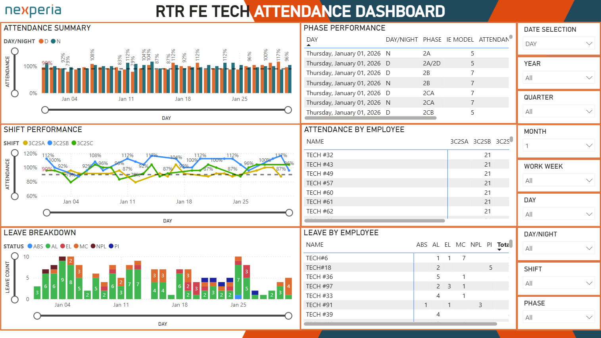

# 📊 Technician Attendance Dashboard

## Overview
This project monitors technician attendance and maintenance activity using Power BI. The goal was to provide clear visibility into attendance trends and support better operational decisions.

## Problem
Tracking attendance and maintenance manually made it difficult to spot patterns, identify gaps, and plan resources effectively.

## Solution
Created a Power BI dashboard to track attendance, highlight trends, and provide an easy-to-understand view for management. Used Power Automate to set up notifications and automate reporting where possible.

## Tools Used
- Excel
- Power BI
- Power Query
- Power Automate

## Key Features
- Overview of attendance by technician and date
- Trend analysis for absenteeism
- Summary charts for quick insights
- Automated notifications for attendance follow-ups

## Impact
- Improved visibility on workforce attendance
- Supported better planning and resource allocation
- Increased accountability through transparent reporting

## Note
Data has been anonymized to protect confidentiality.

## Screenshots

### Power BI Attendance Dashboard

